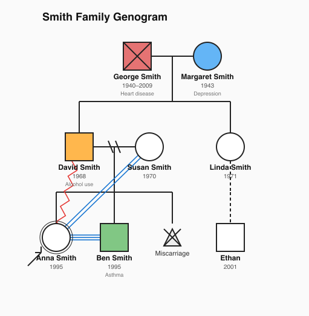

# famtree

[](https://www.npmjs.com/package/famtree)
[](./LICENSE)

A [JSON Schema](./famtree.schema.json) for **genograms** — family diagrams capturing
individuals, their biological/legal relationships, and their emotional bonds — plus a
fast, dependency-free **SVG renderer** and a **CLI**.

Works on **Node ≥ 18** and **Bun**.



## Install

```bash
npm install famtree      # library + CLI
# or
bun add famtree
```

Run the CLI without installing:

```bash
npx famtree family.json -o family.svg
```

## CLI

```
famtree [input.json] [options]

Arguments:
  input.json            Path to a genogram document. Reads stdin if omitted or "-".

Options:
  -o, --output <file>   Write SVG to <file>. Writes stdout if omitted.
  -t, --title <title>   Override the document title.
      --validate        Validate the document against the schema before rendering.
  -h, --help            Show help.
  -v, --version         Show the version.
```

Examples:

```bash
famtree family.json -o family.svg          # file in, file out
cat family.json | famtree > family.svg     # stdin in, stdout out
famtree family.json --validate -o out.svg  # validate, then render
```

> `--validate` uses [`ajv`](https://ajv.js.org). It's an optional peer dependency —
> install it (`npm i ajv`) only if you use the flag.

## Library

```ts
import { renderGenogram } from "famtree";
import type { Genogram } from "famtree";

const doc: Genogram = {
  version: "1.0.0",
  people: [
    { id: "a", sex: "male", name: "Alex" },
    { id: "b", sex: "female", name: "Bea" },
    { id: "c", sex: "female", name: "Cara", isProband: true },
  ],
  relationships: [
    { id: "u", type: "union", partnerIds: ["a", "b"], unionType: "married" },
    { id: "pc", type: "parent-child", childId: "c", unionId: "u" },
  ],
};

const { svg, stats } = renderGenogram(doc);
console.log(stats); // { people: 3, unions: 1, emotions: 0, width, height }
```

Advanced building blocks are also exported: `GenogramRenderer`, `GenogramGraph`,
`GenerationalLayout` (a `LayoutEngine` you can swap), `Positions`, and the `Svg`
builder.

The JSON Schema is published with the package and importable via the `famtree/schema`
export.

## The schema

`famtree.schema.json` (JSON Schema Draft 2020-12) describes a document with three
top-level parts:

- **`people`** — individuals with `sex` (drives node shape), vital status,
  proband/pregnancy flags, twins, birth order, medical/mental-health/substance-use
  `conditions`, and optional style overrides.
- **`relationships`** — a tagged union of:
  - `union` — partnerships (married/cohabiting/…) with a status (divorced,
    separated, widowed, …).
  - `parent-child` — links a child to parents or a union, with biological type
    (adopted/foster/step/…) and pregnancy outcome.
  - `emotional` — bonds (close, fused, conflict, cutoff, hostile, …) with optional
    direction.
- **`layout`** — optional rendering hints, including explicit coordinate overrides.

## Rendering conventions

| Element | Convention |
|---------|------------|
| Male / female / unknown | Square / circle / diamond |
| Deceased | X through the shape |
| Proband | Double outline + arrow |
| Divorce / separation | `//` / `/` across the union line |
| Adoption & non-biological | Dashed parent link |
| Pregnancy loss | Small triangle (miscarriage/abortion) or diamond (stillbirth) |
| Emotional bonds | Colored parallel lines (closeness) or zigzag (conflict) |

## Architecture

The renderer is split into focused modules under `src/`:

| Module | Responsibility |
|--------|----------------|
| `types.ts` | TypeScript types mirroring the schema |
| `constants.ts` | Shared geometry constants |
| `svg.ts` | SVG element builder |
| `graph.ts` | Indexed family-structure model + generation ranking |
| `layout.ts` | `LayoutEngine` abstraction + generational layout |
| `shapes.ts` | Node-shape strategies keyed by sex |
| `bonds.ts` | Emotional-bond style registry |
| `renderer.ts` | Orchestrates the above into an SVG |
| `index.ts` | Public API |
| `cli.ts` | CLI entry point |

## Development

```bash
bun install
bun test           # run tests
bun run typecheck  # type-check
bun run build      # bundle to dist/ (ESM + CJS + d.ts)
bun run example    # render examples/example.genogram.json
```

## License

[MIT](./LICENSE) © Felipe Plets
